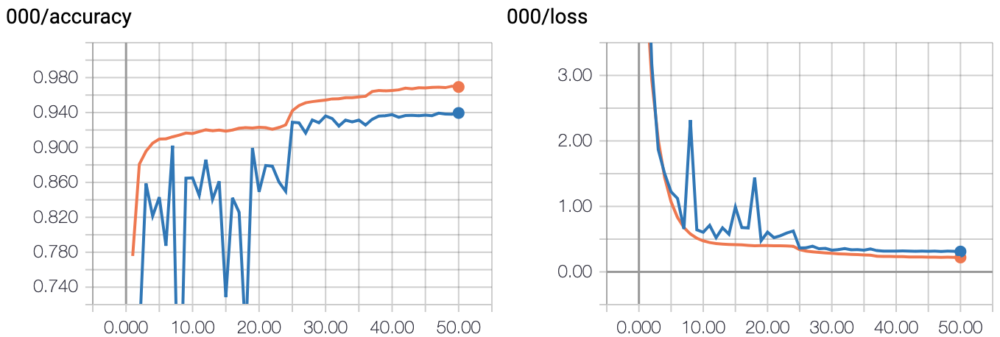

# Fashion Mnist
- 基于 Tensorflow 实现的 DenseNet 分类模型
- 测试数据集 [fashion-mnist](https://github.com/zalandoresearch/fashion-mnist) 。

## 测试环境
- Ubuntu 16.04 LTS
- Python 3.6
- Tensorflow-gpu 1.7.1

## 模型说明
- 基于Tensorflow实现的DenseNet-BC-40并嵌入了SE module (SENet)
- 模型参数
  - 3个Dense Block（11， 11， 11）
  - 模型每层输出 k = 24
  - 转译层的压缩率 θ = 0.25
  - Dropout = 0.2
  - l2正则 weight_decay = 5e-4
- 模型训练
  - 总训练轮次 epoch = 50
  - batch_size = 128
  - 使用动量随机梯度下降算法优化， 动量项: 0.9, nesterov开启， 初始学习率：0.1 ，在第25和37个epoch将学习率分别降至0.01和0.001

## 程序使用
- 下载 fashion-mnist 数据集放到./data目录下面
- 运行 python3 DenseNet.py 

## 结果
- 目录src/logs/保存了模型可视化数据
- 目录src/model_saves/下保存了模型训练好的参数
- 文件 history.csv 保存了模型运行过程结果
- 训练耗时：10005 sec.(单卡1080Ti)
- 测试集最高准确率：93.95%

